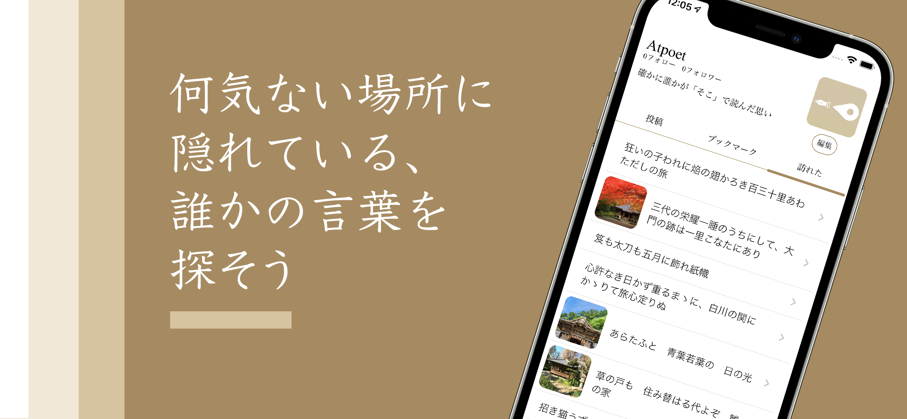

#  Atpoet

場所に紐づいた「思い」を共有するためのアプリ「Atpoet」。
実際に訪れた場所で感じた思いを川柳や俳句、短歌、あるいは写真や形式のない言葉で投稿することができます。
詩や短歌が投稿された場所に行ってみることで、他のユーザーの息遣いを感じることができます。

### ◯Atpoetはどんなアプリ？

オンラインでのコミュニケーション方法が普及し、どこにいても誰かと繋がっていられるようにはなってきていますが、みんなで同じ場所に行って感想を言い合うような楽しみは無くなってしまいました。
Atpoetは道端に咲いている花や綺麗な街並みなど、その場に行って初めて気付く思いをシェアすることで、直接顔を合わせなくても誰かの息遣いを間近で感じることができるアプリです。

### ◯使い方

日々の生活の中や観光先などで何か思いを詠みたくなった時、ぜひこのアプリで投稿してみましょう！
位置情報画面で他の人が詠んだ詩や短歌を見つけて実際に訪れてみましょう。
現地に行かなくても、他の人が詠んだ詩や俳句をスクロールでランダムに確認することができます。

### ◯こんな人におすすめ！

* 詩や短歌を詠みたい人
* 他の人が詠んだ詩や短歌を読みたい人
* 日々の生活に寂しさを感じている人
* 何か面白いことを発見した人
* 観光している時に思いを共有したくなった人
* 他の人とオンラインで繋がりたい人

### ◯機能紹介
#### 1.投稿機能

詠んだ詩や俳句に、写真・タイトル・位置情報・タグを付与して投稿することができます。横書き、縦書きを選択し、投稿時の見た目を整えることができます

#### 2.マップ機能

マップ画面では自分の近くの投稿を確認することができます。その場で投稿を読んだら「訪れた」ボタンを押してみましょう。

#### 3.投稿閲覧機能

ホーム画面では、他のユーザーが投稿した詩や短歌を自由気ままに読むことができます。

#### 4.フォローフォロワー機能

気に入ったユーザーをフォローしていつでも確認できるようにしておきましょう

#### 5.ブックマーク、訪れた機能

投稿をブックマークし、マイページからいつでも見ることができます。「訪れた」は実際にその場所に訪れた時にしか押すことができず、特別なボタンです。

### プライバシーポリシー：
https://sites.google.com/view/kashiwasimple/privacy_atpoet
